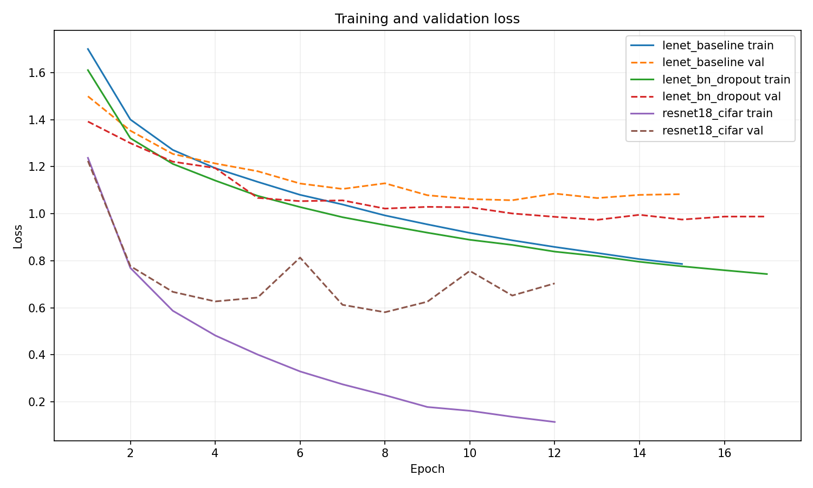
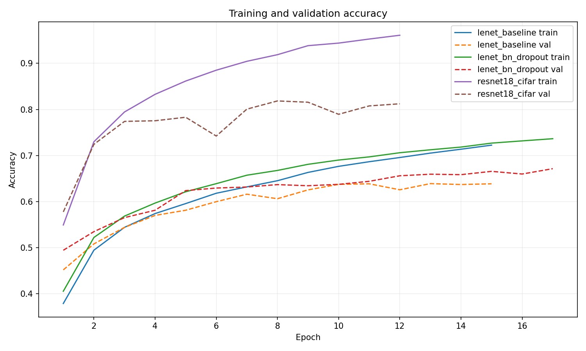
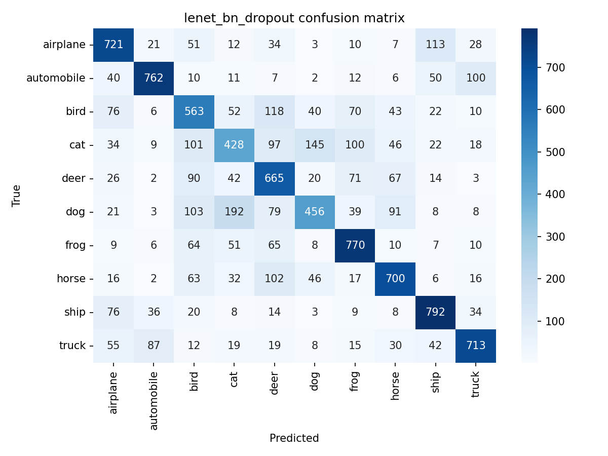
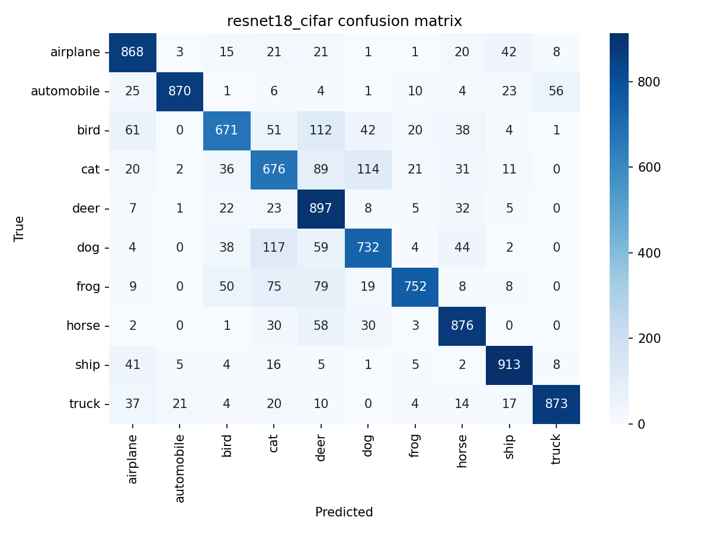
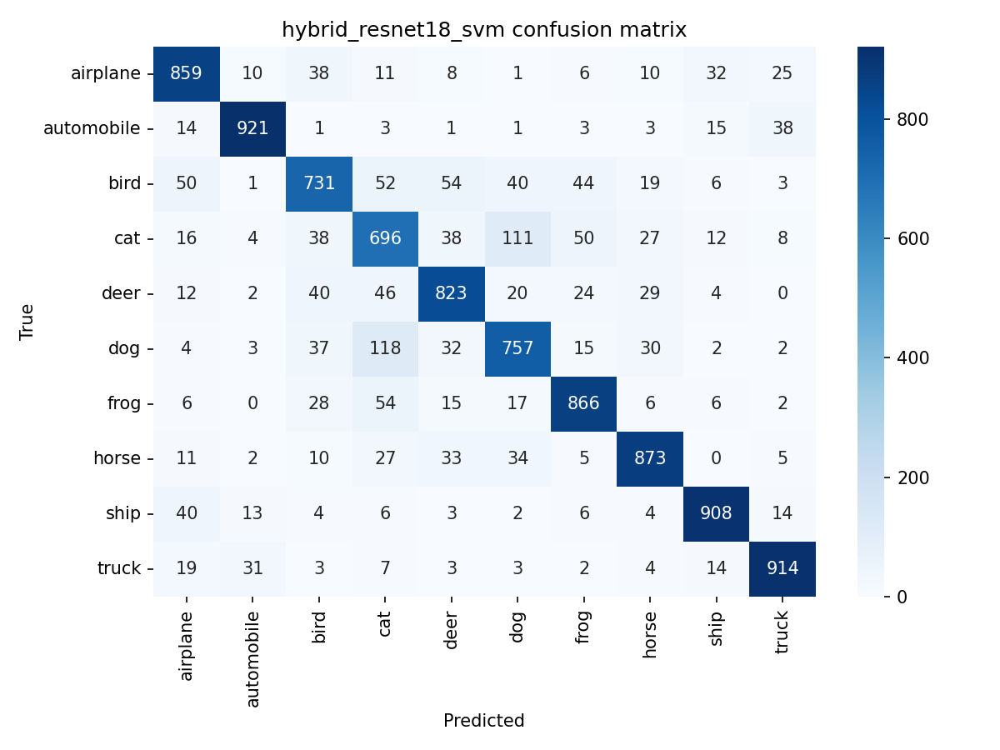
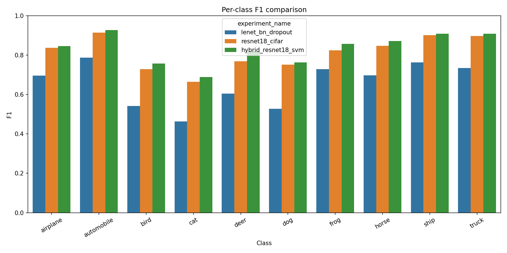

# CIFAR-10 CNN Classification and Hybrid Learning

## Introduction
Bu proje, YZM304 Derin Ogrenme dersi ikinci proje odevini CIFAR-10 veri seti uzerinde tekrar uretilebilir bir deney duzeni ile tamamlamak icin hazirlandi. Hedef, ayni train/validation/test ayrimi uzerinde iki acik yazilmis CNN sinifi, bir literatur tabanli CNN mimarisi ve bir hibrit CNN+SVM yaklasimini egitip karsilastirmaktir.

CIFAR-10 secildi cunku RGB goruntu yapisi LeNet benzeri custom CNN mimarilerini, ResNet tabanli daha guclu bir mimariyi ve bu mimariden ozellik cikarip klasik makine ogrenmesi modeli kullanma senaryosunu ayni problem uzerinde karsilastirmaya izin verir.

GPU kurulumu ve reusable ortam dokumani icin [../docs/windows_gpu_setup.md](../docs/windows_gpu_setup.md) dosyasina bakin.

## Methods
### Dataset and split
- Veri seti: `CIFAR-10`
- Sinif sayisi: `10`
- Siniflar: `airplane, automobile, bird, cat, deer, dog, frog, horse, ship, truck`
- Veri bolmesi: `45000 train / 5000 val / 10000 test`
- Giris sekli: `[3, 32, 32]`
- Normalize mean: `[0.4914, 0.4822, 0.4465]`
- Normalize std: `[0.247, 0.2435, 0.2616]`
- Batch size: `128`
- Seed: `42`

### Theoretical background
Evrişimli sinir aglari, goruntuler uzerinde yerel alici alanlar ve paylasilan agirliklar kullanarak uzamsal desenleri ogrenmeye uygundur. LeNet benzeri yapilar, dusuk seviyeli kenar/doku ozelliklerinden daha soyut siniflandirici ozelliklere giden klasik bir ozellik hiyerarsisi kurar. Batch normalization, ara katman aktivasyonlarini normalize ederek optimizasyonu kararlilastirir; dropout ise ozellikle tam bagli katmanlarda birlikte ezberleme davranisini azaltarak genellemeyi iyilestirmeyi hedefler.

ResNet mimarisindeki residual baglantilar, daha derin aglarda gradyan akisini koruyarak egitimi kolaylastirir. Bu nedenle ResNet18, CIFAR-10 gibi renkli ve sinif ici degiskenligi daha yuksek veri setlerinde LeNet ailesine gore daha guclu temsil ogrenebilir. Hibrit modelde ise son siniflandirici yerine CNN embeddingleri cikarilip lineer SVM ile egitim yapilarak, ogrenilen ozellik uzayinin klasik makine ogrenmesi acisindan ne kadar ayrisabilir oldugu test edilir.

### Model configuration
- `lenet_baseline`: `Conv(3,6,5) -> ReLU -> MaxPool -> Conv(6,16,5) -> ReLU -> MaxPool -> FC(400,120) -> FC(120,84) -> FC(84,10)`
- `lenet_bn_dropout`: temel mimari ile ayni conv/fc boyutlari, ek olarak `BatchNorm2d` ve classifier tarafinda `Dropout(p=0.3)`
- `resnet18_cifar`: `torchvision.models.resnet18(weights=None)` tabanli, `conv1=3x3`, `maxpool=Identity`, `fc=Linear(512,10)`
- Hibrit model: egitilmis `resnet18_cifar` embedding + `Pipeline([StandardScaler(), LinearSVC(C=1.0, max_iter=5000)])`

Tum CNN'ler icin ortak egitim ayarlari:
- Loss: `CrossEntropyLoss`
- Optimizer: `Adam(lr=0.001, weight_decay=0.0001)`
- Early stopping patience: `4`
- Minimum iyilesme esigi: `0.0001`
- Epoch plani: `20 / 20 / 18`

### Hyperparameter rationale
- `batch_size=128`: RTX 4070 Laptop GPU uzerinde bellek kullanimi ile kararlı batch istatistikleri arasinda dengeli bir secim saglar.
- `Adam(lr=0.001)`: CIFAR-10 uzerinde sifirdan egitilen CNN'ler icin hizli ama kontrol edilebilir yakinlama sagladigi icin secildi.
- `weight_decay=1e-4`: ozellikle custom CNN'lerde genel performansi korurken asiri uyumu sinirlamak icin hafif bir L2 etkisi yaratir.
- `patience=4`: validation loss plato yaptiginda gereksiz epoch harcamadan en iyi checkpoint'i korumayi saglar.
- ResNet icin pretrained agirlik kullanilmadi: karsilastirma ayni veri seti ve ayni egitim senaryosu icinde adil kalsin diye `weights=None` secildi.

Calisma zamani:
- Device: `cuda`
- Device name: `NVIDIA GeForce RTX 4070 Laptop GPU`
- Torch: `2.11.0+cu128`
- Torch CUDA: `12.8`
- AMP: `True`

### Hybrid feature export
`resnet18_cifar` modelinin `fc` oncesi `512` boyutlu embedding'i `results/features/` altina `.npy` olarak yazildi:
- `train_features.npy`: `[45000, 512]`
- `val_features.npy`: `[5000, 512]`
- `test_features.npy`: `[10000, 512]`
- `train_labels.npy`: `[45000]`
- `val_labels.npy`: `[5000]`
- `test_labels.npy`: `[10000]`

### Reproducibility
GPU hazir reusable ortam ile tekrar calistirmak icin:

```bash
cd project2
%USERPROFILE%\dl-gpu-py313\Scripts\python.exe run_experiments.py
```

## Results
### Experiment summary
| Experiment | Family | Device | Epochs | Best Epoch | Val Acc | Val F1 | Test Acc | Test F1 | Test Loss |
| --- | --- | --- | --- | --- | --- | --- | --- | --- | --- |
| lenet_baseline | custom_cnn | cuda | 15.0000 | 11.0000 | 0.6386 | 0.6336 | 0.6348 | 0.6296 | 1.0561 |
| lenet_bn_dropout | custom_cnn | cuda | 17.0000 | 13.0000 | 0.6594 | 0.6562 | 0.6570 | 0.6544 | 0.9904 |
| resnet18_cifar | torchvision_cnn | cuda | 12.0000 | 8.0000 | 0.8184 | 0.8189 | 0.8128 | 0.8135 | 0.6042 |
| hybrid_resnet18_svm | hybrid_ml | cuda | 0.0000 | 0.0000 | 0.8434 | 0.8429 | 0.8348 | 0.8346 | 0.0000 |

### Selected models
- Best custom CNN: `lenet_bn_dropout` with test accuracy `0.6570` and macro F1 `0.6544`
- ResNet18 test accuracy: `0.8128`
- Hybrid CNN+SVM test accuracy: `0.8348`

### Additional observations
- Best custom CNN class-level macro avg F1: `0.6544`
- Hybrid class-level macro avg F1: `0.8346`
- Loss and accuracy curves: `results/plots/loss_curves.png`, `results/plots/accuracy_curves.png`
- Confusion matrices: `results/plots/lenet_bn_dropout_confusion_matrix.png`, `results/plots/resnet18_cifar_confusion_matrix.png`, `results/plots/hybrid_resnet18_svm_confusion_matrix.png`
- Per-class F1 comparison: `results/plots/per_class_f1_comparison.png`

### Visuals












## Discussion
`lenet_bn_dropout`, `lenet_baseline` modeline gore test accuracy tarafinda `+0.0222` puan kazanc uretmistir. Bu fark, batch normalization ile aktivasyon dagiliminin daha kararlı hale gelmesi ve dropout ile classifier tarafinda asiri uyumun azalmasi ile aciklanabilir. `resnet18_cifar`, en iyi custom modele gore `+0.1558` puan ek accuracy kazanci saglamistir. Bunun temel nedeni residual baglantilarin daha derin ozellik hiyerarsisi ogrenmesini kolaylastirmasi ve CIFAR-10 gibi renkli/veri karmasikligi daha yuksek veri setlerinde LeNet ailesine gore daha guclu temsiller uretmesidir. Hibrit `LinearSVC`, ResNet embeddingleri uzerinde dogrudan softmax classifier yerine marjin tabanli ayrim yaptiginda `+0.0220` puan ek accuracy elde etti. Bu, `resnet18_cifar` tarafindan uretilen 512-boyutlu ozellik uzayinin lineer olarak daha iyi ayrisabilir oldugunu gosterir. Sinif bazinda en zor sinif `cat` oldu: best custom CNN F1 `0.4635`, ResNet F1 `0.6644`, hibrit model F1 `0.6891`. Benzer gorunumlu hayvan siniflari arasindaki karisiklik, confusion matrix'lerde acikca goruluyor. Hibrit modelde tasit siniflari daha kararlı ayrildi: automobile F1 `0.9270`, ship F1 `0.9085`, truck F1 `0.9090`. Kenar/renk/yapisal ipuclari daha ayirt edici oldugu icin bu siniflar hayvan siniflarina gore daha yuksek performans verdi.

Bu projenin temel sinirliligi, tek veri seti uzerinde ve sabit hiperparametrelerle karsilastirma yapmasidir. Ayrica custom CNN ailesi, ResNet18 kadar derin veya kapsayici degildir; bu nedenle mutlak performans farkinin bir bolumu mimari kapasiteden gelir. Gelecek adimlarda veri artirma, farkli optimizer secenekleri, pretrained agirliklar, daha genis hiperparametre taramasi ve farkli hibrit siniflandiricilar ile karsilastirma genisletilebilir.

## References
- PyTorch Get Started: <https://pytorch.org/get-started/locally/>
- PyTorch 2.11 Release Blog: <https://pytorch.org/blog/pytorch-2-11-release-blog/>
- NVIDIA CUDA Toolkit Release Notes: <https://docs.nvidia.com/cuda/archive/13.1.0/cuda-toolkit-release-notes/index.html>
